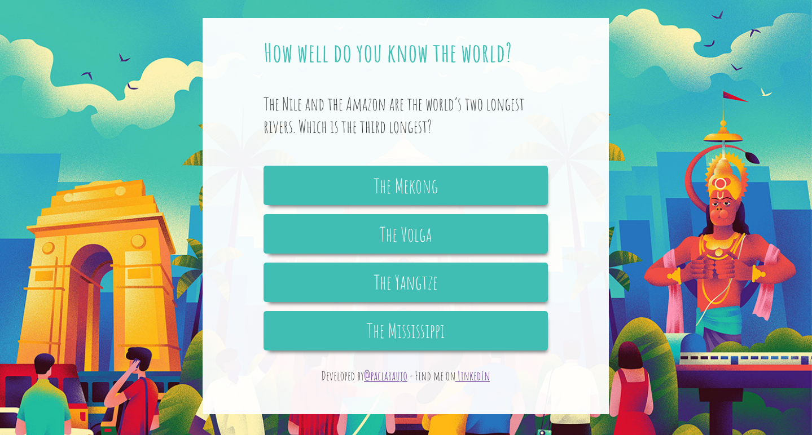

# Letters for my princess

A Trivia with questions and answers about travel. How well do you know the world? This trivia will tell you.



## Getting Started

### Installing

To install the dependencies in your project's directory run:

```
yarn install
```

## Starting the app

```
yarn start
```

Runs the app in the development mode.<br />
Open [http://localhost:3000](http://localhost:3000) to view it in the browser.

The page will reload if you make edits.<br />
You will also see any lint errors in the console.

### Building the app

Builds the app for production to the `build` folder.<br />
It correctly bundles React in production mode and optimizes the build for the best performance.

The build is minified and the filenames include the hashes.<br />
Your app is ready to be deployed!

See the section about [deployment](https://facebook.github.io/create-react-app/docs/deployment) for more information.

## Built With

* [Create React App](https://github.com/facebook/create-react-app)
* ReactJS
* CSS3

## Authors

* **Paloma Araujo** - [@paclaraujo](https://github.com/paclaraujo)

## Acknowledgments

* @laboratoria
* Background Image by [Muhammed Sajid](https://www.behance.net/gallery/84625785/Disney-Illustration) - [Behance](https://www.behance.net/gallery/84625785/Disney-Illustration)
* Quiz questions - [The Telegraph](https://www.telegraph.co.uk/travel/quizzes/travel-lockdown-quiz-2/)
